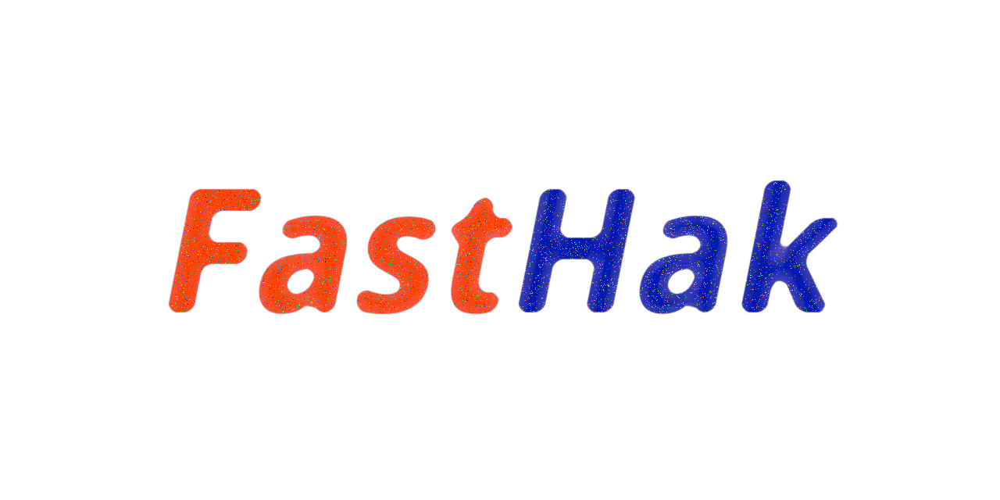

FastHak is a web server written in Go designed for rapid front-end development. It uses Server Sent Events for live-reload, and automatically injects the necessary javascript files, allowing you to get straight to developing your awesome web app.

It is designed to serve on localhost using HTTPS, because modern web-apps need HTTPS to [do](https://developer.mozilla.org/en-US/docs/Web/API/Server-sent_events/Using_server-sent_events#sending_events_from_the_server) [awesome](https://developer.mozilla.org/en-US/docs/Web/API/Web_Workers_API#specifications) [stuff](https://developer.mozilla.org/en-US/docs/Web/API/WebRTC_API). You need to provide your own certs. I recommend [mkcert](https://github.com/FiloSottile/mkcert#readme).

FastHak is a small binary you can drop directly in your project root and invoke like so:

```
$ fasthak -dir=public --port=9443
```

Which will serve your app on `https://localhost:9443`.

The client-side code is available at `https://localhost:9443/.hak/js`. You do not need to include these files. They are embedded in the server itself.
